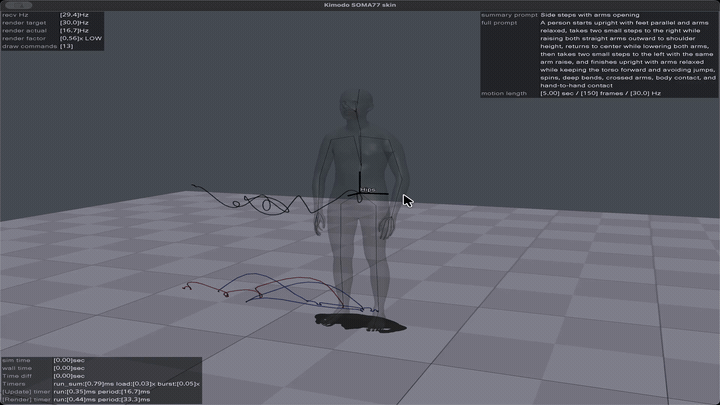
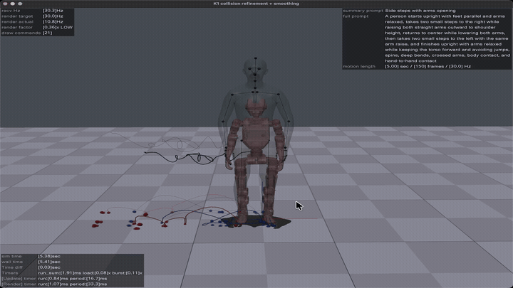

# Kimodo on Apple Silicon macOS

[](assets/kimodo_macos_demo.mp4)

*Click the preview to open the original video.*

This repository provides a simple way to run Kimodo SOMA77 text-to-motion
generation on an Apple Silicon Mac. It supports both Metal/MPS and CPU and
saves each generated motion as a portable NPZ file.

The supported environment manager is **Conda**.

## Requirements

- An Apple Silicon Mac (`arm64`).
- Git and the macOS Command Line Tools.
- Conda. Miniforge is recommended.
- At least 32 GB of unified memory and 25 GB of free disk space.
- A Hugging Face account with a read token.

The first generation downloads a large text encoder and a Kimodo checkpoint.
Later generations reuse the local cache.

## Installation

### 1. Install Conda

Skip this step if `conda --version` already works.

With Homebrew:

```bash
brew install --cask miniforge
/opt/homebrew/Caskroom/miniforge/base/bin/conda init zsh
exec zsh
```

Confirm the installation and machine architecture:

```bash
conda --version
uname -m
```

`uname -m` should print `arm64`.

If Homebrew is unavailable, install the Apple Silicon version of
[Miniforge](https://github.com/conda-forge/miniforge) and reopen the terminal.

### 2. Clone the repository

```bash
git clone --recurse-submodules https://github.com/sjchoi86/kimodo_macos.git
cd kimodo_macos
```

If the repository was cloned without `--recurse-submodules`, initialize the
Kimodo source with:

```bash
git submodule update --init --recursive
```

### 3. Create the Conda environment

```bash
./setup_macos.sh
```

The script creates a dedicated environment named `kimodo-macos`, installs the
pinned Kimodo package and PyTorch, and checks whether MPS is available.

The final output should include:

```text
torch:[2.13.0] mps:[True]
```

The script can be run again safely to update or repair the environment.

### 4. Prepare Hugging Face access

Sign in to [Hugging Face](https://huggingface.co/) and accept the terms for
[Meta Llama 3 8B Instruct](https://huggingface.co/meta-llama/Meta-Llama-3-8B-Instruct)
if requested. Then create a read token in the Hugging Face access-token
settings.

Log in from the Conda environment:

```bash
conda run --no-capture-output -n kimodo-macos hf auth login
```

Paste the read token when prompted. Verify the login:

```bash
conda run --no-capture-output -n kimodo-macos hf auth whoami
```

The token is stored in the user's Hugging Face configuration. It is not stored
in this repository or in generated NPZ files.

### 5. Verify the installation

```bash
conda run -n kimodo-macos python -c \
    'import torch; import kimodo; print(torch.__version__); print(torch.backends.mps.is_available())'

conda run -n kimodo-macos python validate_motion.py \
    outputs/side_steps_arms_open_5s.npz
```

The first command should print the PyTorch version followed by `True`. The
second command validates an example motion included in the repository and does
not download a model.

## Generate a motion

Run the following command from the repository root. The first generation must
be online because it downloads the required models:

```bash
HF_HUB_OFFLINE=0 ./run_motion.sh \
    mps \
    "A person walks forward for four steps and stops upright with both arms relaxed" \
    5.0 \
    100 \
    first_walk_5s \
    "Walk forward and stop" \
    7
```

The arguments are:

```text
backend full_prompt duration_seconds diffusion_steps output_name summary_prompt seed
```

Use `mps` for Apple Metal acceleration or `cpu` for CPU generation. After the
models have been downloaded, the same command can run without network access
by changing `HF_HUB_OFFLINE=0` to `HF_HUB_OFFLINE=1`.

The script never overwrites an existing motion.

## Output files

The example above is saved as:

```text
outputs/first_walk_5s.npz
```

Each NPZ contains the SOMA77 motion, foot contacts, FPS, prompts, generation
settings, and runtime information in one portable file. It contains no Python
object arrays and can be opened with `allow_pickle=False`.

Validate any generated motion with:

```bash
conda run -n kimodo-macos python validate_motion.py \
    outputs/first_walk_5s.npz
```

Downloaded models are cached under `hf-cache/hub`. Generated motions are stored
under `outputs`.

## Load a motion with NumPy

```python
from pathlib import Path

import numpy as np

path = Path("outputs/first_walk_5s.npz")

with np.load(path,allow_pickle=False) as archive:
    positions = np.asarray(archive["posed_joints"])
    rotations = np.asarray(archive["global_rot_mats"])
    contacts = np.asarray(archive["foot_contacts"])
    fps = float(np.asarray(archive["fps"]).reshape(-1)[0])
    prompt = str(np.asarray(archive["text_prompt_full"]).reshape(-1)[0])

print("positions:",positions.shape)
print("rotations:",rotations.shape)
print("contacts:",contacts.shape)
print("fps:",fps)
print("prompt:",prompt)
```

## Troubleshooting

- If `conda` is not found, reopen the terminal after installing and
  initializing Miniforge.
- If Hugging Face returns `401`, `403`, or a gated-model error, accept the model
  terms and log in again:

```bash
conda run --no-capture-output -n kimodo-macos hf auth login
conda run --no-capture-output -n kimodo-macos hf auth whoami
```

- If offline mode reports a missing model, run the first generation with
  `HF_HUB_OFFLINE=0`.
- If MPS is unavailable, confirm that `uname -m` prints `arm64`, then rerun
  `./setup_macos.sh`.

## Notes

- MPS and CPU may produce different results with the same seed.
- Native motion correction is optional and disabled in the default macOS
  workflow.
- Measurements are available in [RESULTS.md](RESULTS.md).

The Kimodo source is included as a pinned Git submodule. Source code and model
checkpoints have separate license terms. Review the upstream licenses before
redistributing generated data or using it commercially.

- [Official Kimodo repository](https://github.com/nv-tlabs/kimodo)
- [Pinned MPS fork](https://github.com/atticus-lv/kimodo)

## Humanoid motion retargeting

Generated Kimodo NPZ motions can be retargeted to humanoid robots and rendered
with [RIMKit](https://github.com/tmjeong1103/RIMKit).

[](assets/kimodo_rimkit_demo.mp4)

*Click the preview to open the original video.*
